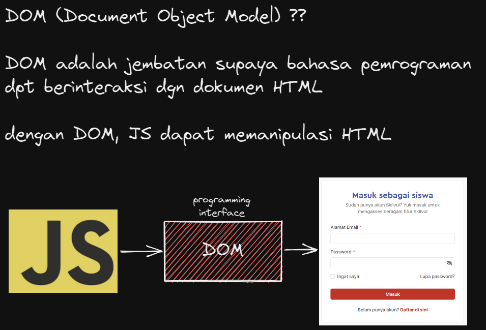
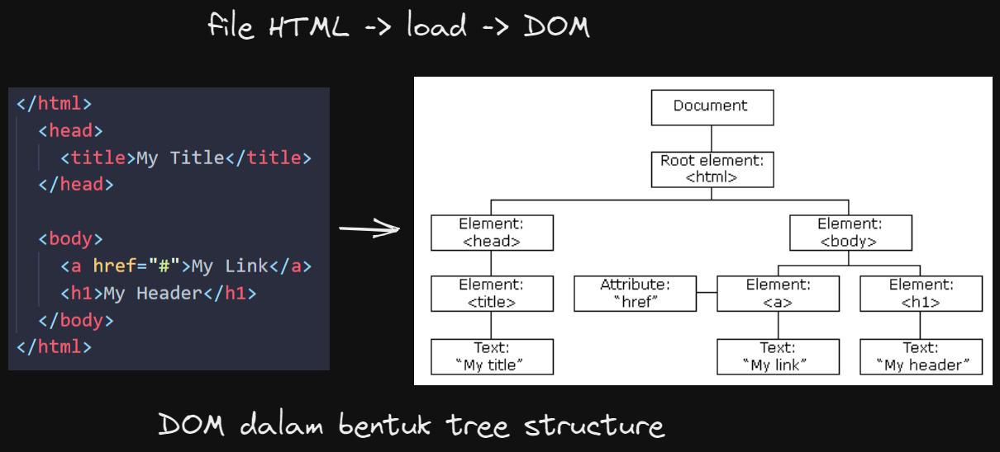

# DOM intro & traversing

[cheat sheet traversing](https://drive.google.com/file/d/1yb8EHMLfcvWCOhTaTuNgQ1WG_o6XbCOR/view?usp=sharing)





kalau yg didapat dlm bentuk `HTMLCollection` atau `NodeList`. cara aksesnya mirip seperti array, menggunakan angka index

```
HTMLCollection !== Array
NodeList !== Array
```